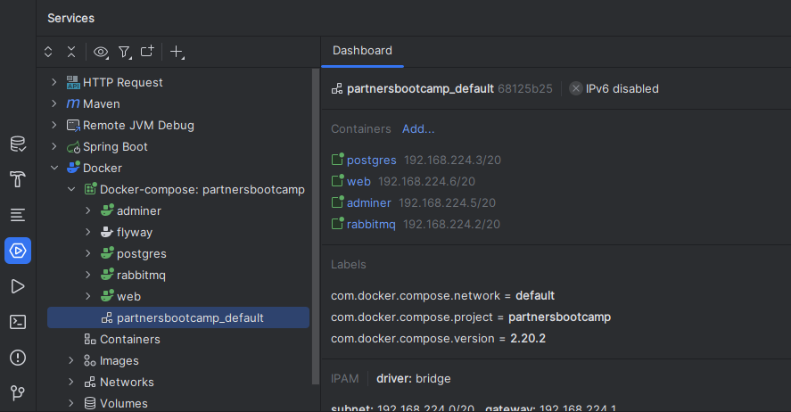

# Partners Bootcamp

### Prerequisites
- Intellij IDEA
  - Java 17
  - Git
- Docker
  - Use Google if you have to troubleshoot running Docker :)
  - Tips for Windows CMD
    - Run "*wsl --status*"
    - Run "*wsl update*" if needed
    - Restart PC after tips

### Setting up
- Clone Repository "*https://github.com/AscariaQuynn/PartnersBootcamp.git*"
- Run "*mvn clean install*"
- Run "*docker-compose.yml*" (right click on it and select "*Run 'Compose Deployment'*")

Automagically, after longer download, preparing, etc..., you have all things at your disposal now.

### Usage

- **Web REST API** is available for requests at "*http://localhost:8080*"
  - you can use "*scratch-requests.http*" for running example requests
- **PostgreSQL** is available at "*jdbc:postgresql://localhost:5432/postgres*"
- **Flyway** takes care of preparing Database
- **Adminer** is available at "*http://localhost:8000*" with **Credentials**:
    - System: PostgreSQL  
      Server: postgres  
      User: postgres  
      Password: postgres  
      Database: postgres
- **RabbitMQ** is available at "*rabbitmq*"
- **RabbitMQ Management** plugin at "*http://localhost:15672*" with **Credentials**:
  - Username: guest  
          Password: guest

### Enjoy your ride :)

