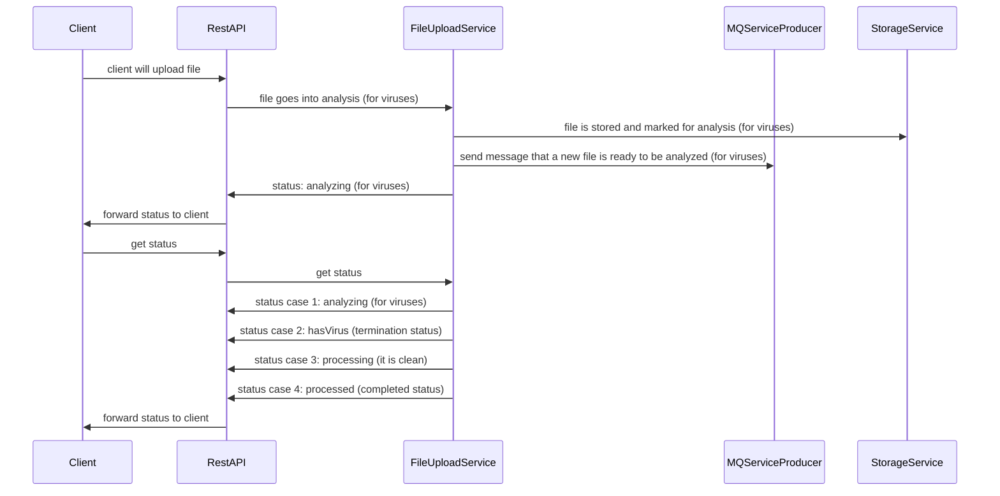
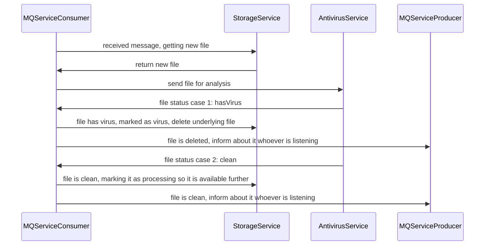
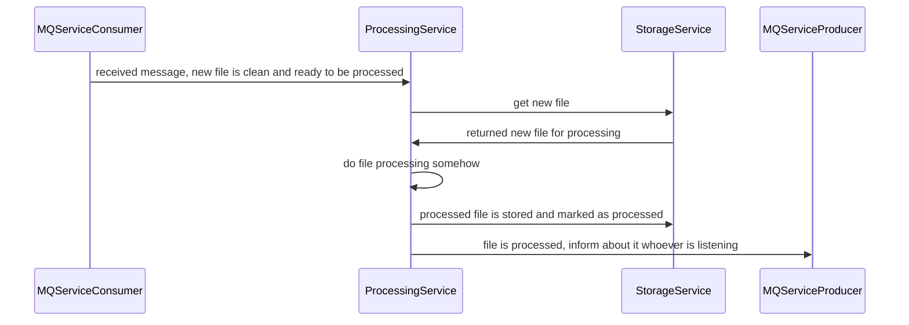

# Upload file diagram

According to Googling, file that contains a virus is generally safe to store in database. We should not run parsers, etc. on it before checking it with antivirus. So I'm assuming it is safe for this scenario and will proceed this way. Change to this flow is possible, for example store it elsewhere, encode it into base64 first to be "unusable", so it can be checked by antivirus and don't make client blocking operation of it. 

